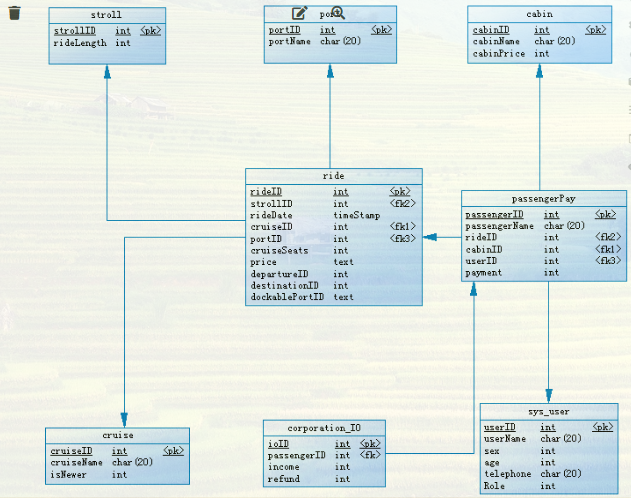
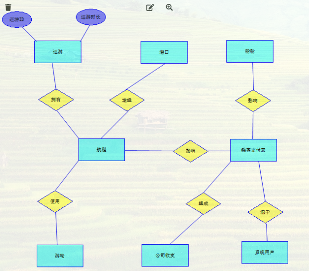

[toc]
># ==选题综述==
**按照下列描述进行数据库设计，主要完成需求分析、概念设计与逻辑设计**
# 英文原题 
Academy Cruises Company (ACA) has decided that their manual system of booking passengers onto their ships will not hold up when they get a new one next month. They currently have two ships (not including the new one) and will probably expand to five or six by 2015. They are named “Goodsea” and “Goodwind,” and the new one will be called “Goodsky.” Eachship has a specific passenger capacity and registry. Registry is the country that the ship is registered with. They do not need to worry about tonnage or draft or anything else about the ship. Each year ACA puts out a brochure with information about their cruises. Every cruise has a name and duration in number of days. They offer three, seven, eleven, and fourteen day cruises. Each cruise also has a specific ship assigned to it; some people want to go on only the newer ships. For each cruise, there are different port stops. A three day cruise will have only one stop, always on the second day of the cruise; a seven day cruise will have three port stops. Cascade varies port stops depending on where the cruise originates. For example, the Los Angeles, CA cruises go to Mexico ports like Cabo San Lucas and Acapulco, the Miami cruises go to the Bahamas and the Virgin Islands, and the Anchorage cruises make stops all through Alaska. Depending upon the length of each cruise, the cruise will make port calls on different days out. Passengers book a given cruise, which has a certain length and number of ports. Depending on the cruise that they pick, customers are informed of the available cabins. After the passenger chooses a cabin, they can get a price. The price also depends on the number of people in the cabin and the “class” of the cabin. After the cabin is booked, it is then removed from the list of available cabins unless the passenger indicated that they want to share with someone else. If the cabin can hold four people, and they are traveling alone, then the price will be cheaper if they share. After passengers are booked and a deposit is received, the travel agent who made the reservation will receive the commission for the cruise.

# 中文翻译（搜狗）
学院游轮公司(ACA)已经决定，当他们有了新的游轮后，他们的手工订票系统将不再适用下个月。他们目前有两艘船(不包括新的那艘)，到2015年可能会增加到五六艘。它们被命名为“Goodsea”和“Goodwind”，新的将被命名为“Goodsky”每艘船都有特定的载客量和注册。注册地是船舶注册的国家。他们不需要担心吨位或吃水深度或船的其他任何事情。每年ACA都会出版一本小册子，介绍他们的航行情况。每次巡游都有一个名称和持续天数。他们提供**三天、七天、十一天和十四天的巡游**。每个巡航也有一个特定的船只分配给它；==有些人只想乘坐较新的船只==。**每次巡游都有不同的停靠港口**。==为期三天的巡航将只有一个停留，总是在巡航的第二天；七天的巡游将有三个港口停留。Cascade根据游轮的出发地点改变停靠的港口==。例如，加州洛杉机游轮去墨西哥的Cabo圣卢卡斯和阿卡普尔科等港口，迈阿密游轮去巴哈马和维尔京群岛，安克雷奇游轮在阿拉斯加中途停留。根据每次巡航的时间长短，巡航将在不同的日期停靠港口。乘客预订一个特定的邮轮，该邮轮有一定的长度和港口数量。==根据他们选择的邮轮，客户被告知可提供的客舱==。乘客选好舱位后，他们可以得到一个**价格**。价格还取决于客舱的人数和客舱的“等级”。在客舱被预订后，它将从可用客舱列表中删除，除非乘客表示他们希望与其他人共享。如果机舱能容纳四个人，而且他们是一个人旅行，那么如果他们合租的话价格会更便宜。在乘客预订并收到押金后，预订的旅行社将收到游轮的佣金。

## 课题要求
>>**项目要求**：自由一组，经阅读文献了解知识后，设计需求，设计数据库，==根据项目实际描述进行分析、设计，并使用 powerdesigner 画出数据流程图、E-R 图并转换为关系模型。==
>>**课题要求**：
（1）设计方案要合理；
（2）能基于该方案完成系统要求的功能；
（3）设计方案有一定的合理性分析。

# 一、工具依赖

# 二、技术依赖

# 三、分析实现
## 0. 问题分析
- ==就是要设计实现一个订票管理系统==，现在有两艘船，即将新进一艘船；
- 注册地是注册的国家
- 每次巡游都是一个操作单元，有属性名称+巡游天数
- 巡游有3天、7天、11天和14天几种，每次巡游任务都会分配船只
- 乘客会有人只想使用新船
- 巡游的停靠港口不固定
- 3天巡游的船只只能在第二天停靠港口
- 7天巡游的任务可以停靠3个港口
- 其余的根据出发地调整停靠港口
- 根据巡航时间长短，调整停靠港口的日期
- 给定航程，告知用户客舱量；选好客舱后得到价格
- ==价格==取决于客舱人数+客舱等级
- 被用户预订的客舱，如果用户（乘客）不共享客舱，则系统不再显示；否则继续显示；
- 共享-合租客舱可以得到价格优惠
- 顾客预订并支付后，供给商得到佣金。
## 1、数据库设计实现
### 1.0 初步分析设计
>根据如上分析，需要设计至少如下表，得出如下结论

1. 公司需要向乘客展示航程，乘客根据航程和自己的需要选择航程并预定；
2. 航程表需要存储使用的船只，对应巡游，剩余座位，当前价格，出发地，目的地，航程表根据出发地和目的地去港口表查询途经的港口，并最终选择可停靠港口，先采用随机选择方式选择可停靠港口；
3. 乘客需要是本系统的用户，预订之后需要提交支付信息，并存储到支付表中；
4. 公司收支表根据用户支付表的数据进行统计，得到公司最终的收入，如果有乘客退款，那么删除支付表中相应条目，在公司收支表操作refund退款数据，并重新计算最终收益；
5. 港口表需要记录所有的可停靠港口；
6. 乘客支付需要根据选择的舱段，确定最终价格；
7. 用户表存储了用户角色，乘客只能看到基本航程信息相关表；而管理员可以查看所有数据信息；

**当前缺陷：**
1. 暂时没有实现有的乘客更喜爱新船；
2. 暂时没有实现乘客是否共享船舱从而调整不同的价格的问题；

| 表名       | 属性                                                                                   | 备注                                   |
| ---------- | -------------------------------------------------------------------------------------- | -------------------------------------- |
| 巡游表     | strollID,rideLength                                                                    | 标识每次巡游的基本信息                 |
| 港口表     | portID,name                                                                            | 可停靠的港口                           |
| 客舱表     | cabinID,cabinName,price                                                                |                                        |
| 船只表     | cruiseID,cruiseName,isNewer                                                            |                                        |
| 航程表     | rideID,strollID,rideDate,cruiseID,cruiseSeats,price,departure,destination,dockablePort | 航程选定的船只及客舱价格等             |
| 乘客支付表 | passengerID,userName,rideID,cabinID,payment                                            | 用于管理公司收到的乘客支付，一人一条目 |
| 乘客表     | pasengerID,passengerName,cabinID,rideID                                                | 用于存储已经购票的乘客的信息           |
| 用户表     | userID,userName,sex,age,telephone,Role                                                 | 用于存储注册系统的用户                 |
| 公司收支表 | IOID,income,refund                                                                     | 用于存储公司总收入和退款金额           |
### 1.1 实体及属性
### 1.2 系统E-R图

由于操作手残的问题，导致有些表的数据类型和元组内容出现错误，**后期再更改**

## 2.系统逻辑设计
### 2.1 系统关系模型
### 2.2 系统表结构

# 四、技术实现
## 1. 综述

## 2. 实现效果

# 五、问题综述

# 六、项目总结

# 七、参考文献

# 附录
